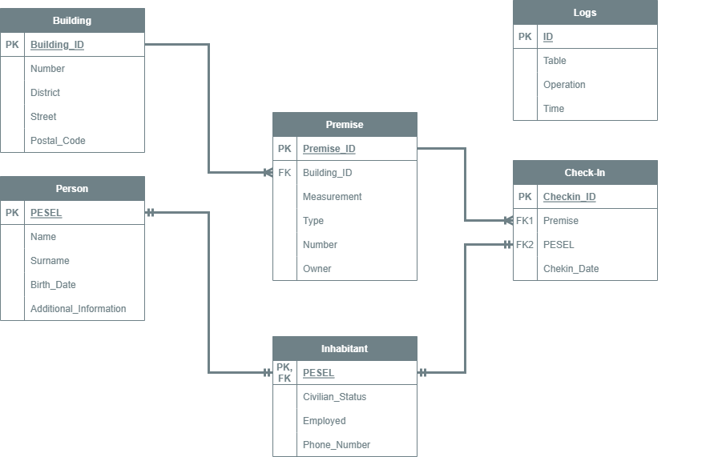
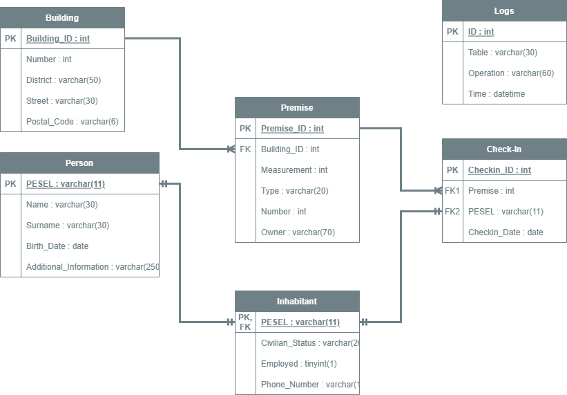

# Database-Project
# Local Registration Database

A MySQL database project created as of a private contract and a tool for getting experience with databases.    

# About

The main goal of the database is to support the management of registrations locally in the city. It is also a good tool for learning the basics of how MySQL databases work and their basic functionalities.

Database tracks the history of all check-ins which took place, registered buildings with premises inside them and also inhabitants registered in property described by the registration.

# Database schemes

The first step of the project was to create an entity relationship schema as to see which entities do we need, what attributes does every entity needs and how they should be connected with each other.

  

After that process I have decided to create a schema with tables which were going to be included into database and their respective columns. This new schema looks like this.

 

# Database structure

## Tables

* **Person** - Table for storing personal information about people. Each row contains information about one person identified by their respective ID (in Poland it is done by PESEL).

* **Inhabitant** - Stores optional information about inhabitants and their contact data. Every row contains those informations for person with given ID (every person in that table is also found in Person table by the same ID).

* **Building** - Table for storing information about registered buildings. Each building is identified by unique ID and has basic information about its location and address.

* **Premise** - Contains informations about every officially registered premise inside buildings. Each record identifies one premise by unique ID and stores general information about it and to which building does it belong (identified by building ID).

* **Check-In** - Tracks the history of all registrations that have been officially approved. Each check in has information about person and locale for which the procedure has took place and the date of approval.

* **Logs** - Contains the information about actions taken inside database such as updating content of table or adding/deleting records from given table.

## Procedures

* **validate_PESEL(IN : PESEL varchar(11))** - Checks if given string is a valid PESEL (Polish Government ID). On input it takes a string and determines if it is a correct PESEL by using specific method destribed by official sources.
If validation results in a failure, the proper status message will be shown.

* **validate_phone_number(IN: number varchar(12))** - Takes on input a string and checks if it is a valid phone number in format `+xxyyyyyyyyy` where x and y are numbers from 0 to 9. If validation results in a failure, the proper status message will be shown. 

* **validate_postal_code(IN: cod varchar(6))** - Checks if given string on input is a valid postal code in Poland where format of that code is `xx-yyy` (x and y are numbers from 0 to 9). If validation results in a failure, the proper status message will be shown.

* **receive_contact_data()** - Returns a list of all registered inhabitants identified by their PESEL with their names, surnames and phone numbers. This procedure does not take any input parameters.

* **receive_recent_checkins(IN: beginYear DATE, endYear DATE)** - Returns a list of all check-ins registered between dates given as input parameters. If not eligible registrations have been not found then the empty list will be returned.

 * **apartaments_full_addresses()** - Returns a list of full addresses for every premise registered inside the database. These can be used for formal procedures or to get a location of a given premise.

* **data_about_habitant(IN: PESEL varchar(11))** - On input takes a PESEL of given habitant and as a result returns detailed informations such as where they are registered, in which premise and building etc.

## Triggers

All triggers inside the database can be described by one of formulas written below:

* **(before | after)\_(table_name)\_(insert | update | delete)** - For a given record that matches all rows of table defined by **table_name** that is either added to the table, updated or just deleted from it, the trigger saves a new record inside `Logs` table describing operation that takes place. Mentioned record is saved into `Logs` either before the operation is fully done (when the database tries to do the task) or when it is successfull and the requested operation is done.

* **validate_field_name_(insert | update)** - For a given record that has a matching column defined by **field_name** that is either added to the table or updated, it will check if data provided for the column is valid by calling a one of validation procedures mentioned above. Validation procedures will deal with incorrect input accordingly to their error management.
